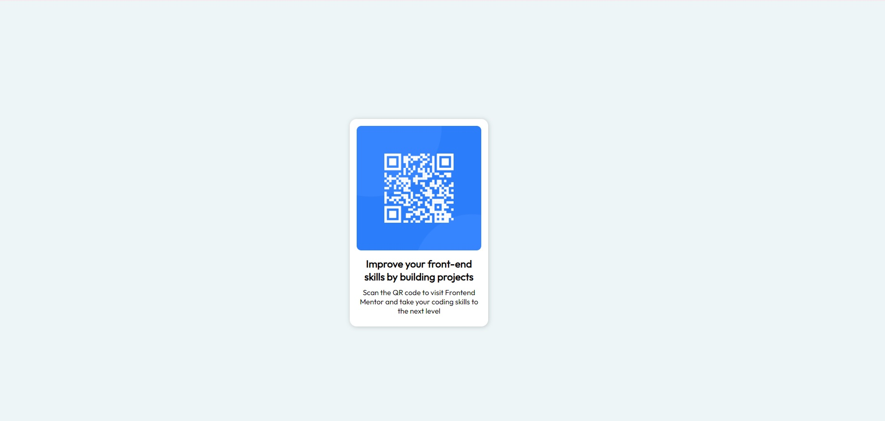

# Frontend Mentor - QR code component solution

This is a solution to the [QR code component challenge on Frontend Mentor](https://www.frontendmentor.io/challenges/qr-code-component-iux_sIO_H). Frontend Mentor challenges help you improve your coding skills by building realistic projects.

## Table of contents

- [Overview](#overview)
  - [Screenshot](#screenshot)
  - [Links](#links)
- [My process](#my-process)
  - [Built with](#built-with)
  - [What I learned](#what-i-learned)
- [Author](#author)

## Overview

### Screenshot

### Links

- Solution URL: [https://github.com/DunkelMaximus/QR-CODE_COMPONENT](https://github.com/DunkelMaximus/QR-CODE_COMPONENT)
- Live Site URL: [https://dunkelmaximus.github.io/QR-CODE_COMPONENT/](https://dunkelmaximus.github.io/QR-CODE_COMPONENT/)

## My process

### Built with

- Semantic HTML5 markup
- CSS custom properties

### What I learned

In this challenge, I learned how to properly approach a challenge and how to think before starting it. I initially planned on all the ways to complete this challenge and chose the idea which I most preferred.

I also learned that it is best to complete the html part first and then proceed with styling it. This made the challenge much more fun and simpler.

## Author

- Frontend Mentor - [@DunkelMaximus](https://www.frontendmentor.io/profile/DunkelMaximus)
